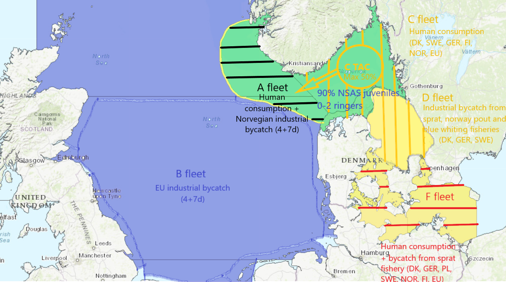

```{r setup, include=FALSE}
library(stockassessment)

colorize <- function(x, color) {
  if (knitr::is_latex_output()) {
    sprintf("\\textcolor{%s}{%s}", color, x)
  } else if (knitr::is_html_output()) {
    sprintf("<span style='color: %s;'>%s</span>", color, 
      x)
  } else x
}

displayNum <- Vectorize(function(x,capitalize = FALSE){
    y <- switch(as.character(x),
                "0"="Zero",
                "1"="One",
                "2"="Two",
                "3"="Three",
                "4"="Four",
                "5"="Five",
                "6"="Six",
                "7"="Seven",
                "8"="Eight",
                "9"="Nine",
                formatC(as.numeric(x),big.mark=",",small.mark=".",digits=0,format="f"))
    if(!capitalize & x < 10)
        return(tolower(y))
    return(y)                
},"x")

thisY=as.numeric(substring(Sys.Date(),1,4))
fitthisY <- fitfromweb(paste0("WBSS_HAWG_",thisY), character.only = TRUE)

TACa_NSWB <- 385008 # same as 2019
TACf <- 3150 # 9001 in 2019
TACc_NSWB <- 0.41*(2*TACf)+0.057*TACa_NSWB # 29326 in 2019
TACd_NSWB <- 6659 # same as 2019


```

## Current TAC setting in Subdivision 22-24
> See COUNCIL REGULATION (EU) 2019/1838 of 30 October 2019 fixing for 2020 the fishing opportunities for certain fish stocks and groups of fish stocks applicable in the Baltic Sea and amending Regulation (EU) 2019/124 as regards certain fishing opportunities in other waters.

In October, TAC is agreed for subdivision 22-24 following the EU multiannual plan for the stocks of cod, herring and sprat in the Baltic Sea. 
This TAC concerns the F-fleet and is attributed totally to WBSS so: $TAC_{22-24}=TAC_{F_{WBSS}}$ 

In `r thisY`, $TAC_{F_{WBSS}}=$ **`r displayNum(TACf)` t**.


## Current TAC setting in the North Sea

TO FILL for A and B fleet


## Current TAC setting in Division 3.a
> See AGREED RECORD OF CONCLUSIONS OF FISHERIES CONSULTATIONS BETWEEN NORWAY AND THE EUROPEAN UNION ON THE REGULATION OF FISHERIES IN SKAGERRAK AND KATTEGAT FOR 2020

In december, TAC for division 3.a is agreed between the EU and Norway and depends on the TAC setting adopted during the 2014 Working Group on management measures for herring in the Skagerrak and Kattegat.

1. $TAC_{WBSS}=2TAC_{22-24}=2TAC_{F_{WBSS}}$ so in `r thisY`, $TAC_{WBSS}=$ **`r displayNum(2*TACf)` t**.

2. Assuming 1. and given the TAC for the A-fleet in the North Sea $TAC_{A_{WBSS+NSAS}}$, $TAC_{C_{WBSS+NSAS}}$ for human consumption in 3.a is calculated as $TAC_{C_{WBSS+NSAS}}=0.41TAC_{WBSS} + 0.057TAC_{A_{WBSS+NSAS}}$.

<span style="color:grey"> I assume the $0.057TAC_{A_{WBSS+NSAS}}$ corresponds to the part of the catch for the A-fleet in 3.a (and 4-7dE). The TAC rule for the C-fleet could therefore be explained by either 41% of the WBSS total catch is taken by the C-fleet in 3.a, or 41% of the WBSS total catch approximate the WBSS+NSAS catches by the C-fleet in 3.a. If the first one is true, and since 50% of $TAC_{WBSS}$ is taken by the F-fleet in 22-24, then it follows that, the remaining 9% of $TAC_{WBSS}$ is taken by the D-fleet in 3.a.  </span>

Since $TAC_{A_{WBSS+NSAS}}=$ **`r displayNum(TACa_NSWB)` t** in `r thisY`, $TAC_{C_{WBSS+NSAS}}=$ **`r displayNum(round(TACc_NSWB))` t**. 

3. 50% of Norwegian $TAC_{C_{WBSS+NSAS}}$ can be taken in the Norwegian Economic Zone and 50% of EU $TAC_{C_{WBSS+NSAS}}$ can be taken in the North Sea so transferred to $TAC_{A_{WBSS+NSAS}}$

4. Then the TAC for the industrial and sprat bycatch fisheries in 3.a (D-flieet) is given. In `r thisY`, $TAC_{D_{WBSS+NSAS}}=$ **`r displayNum(TACd_NSWB)` t**. 

<span style="color:grey"> I'm not sure where this number is coming from but it's been pretty constant in the past years. 9% of $TAC_{WBSS}$ would be 567 t, which is only a very small proportion of `r displayNum(TACd_NSWB)` t. Does it mean the D-fleet mainly fish NSAS? Am I misunderstanding something or there is just a lack of consistency between the C-fleet TAC rule and the D-fleet TAC rule? </span>


5. Thereafter, at HAWG, we take our own assumptions to split the above TACs in 3.a between WBSS and NSAS as follows:


```{r include=FALSE}
url_dir=paste0("https://www.stockassessment.org/datadisk/stockassessment/userdirs/user295/WBSS_HAWG_",thisY,"/") # URL of assessment directory
url_forecast <- paste0(url_dir, "run/forecast.RData")
load(url(url_forecast)) # load an object called FC 

TACfleet <- attributes(FC[[1]])$catchby[which(rownames(attributes(FC[[1]])$catchby)==as.character(thisY)),seq(1,ncol(attributes(FC[[1]])$catchby),3)]
TAC <- sum(TACfleet)

TACNSWB <- c(385008, 24528, 6659, 3150) # TAC given for herring in North Sea and western Baltic
#catch_all <- apply(catchthisY[,(ncol(catchthisY)-(sum(fitthisY$data$fleetTypes==0)-1)):ncol(catchthisY)],1,sum)
#prop_C <- catchthisY[(fitthisY$data$noYears-2):fitthisY$data$noYears,which(colnames(catchthisY)=="Obs(Fleet w.o. effort 3)")]
propWB_C <- 0.7284 # 3-year average split
propWB_D <- 0.3381 # 3-year average split
utiliz_C <- 0.50 # given by Pelagic RAC
utiliz_D <- 0.0547 # 3 years average utilization
options(scipen=999)
star.symbol='&#42;'
```

**Table: Catch constraint in the intermediate year `r thisY` (tonnes)**

Fleets| $TAC_{WBSS+NSAS}$ | $TAC_{WBSS}$| $TAC_{WBSS}$ given utilization|
:-----| :------------------| :-----| :-----------------------|
A     |    `r TACNSWB[1]`  | `r TACfleet[1]` __`r star.symbol`__| 100% = `r TACfleet[1]`|
C     |    `r TACNSWB[2]`  | `r propWB_C*100`% = `r round(propWB_C*TACNSWB[2])` __`r star.symbol``r star.symbol`__| `r utiliz_C*100`% = `r round(utiliz_C*propWB_C*TACNSWB[2])` __`r star.symbol``r star.symbol``r star.symbol`__|
D     |    `r TACNSWB[3]`  | `r propWB_D*100`% = `r round(propWB_D*TACNSWB[3])` __`r star.symbol``r star.symbol`__|`r utiliz_D*100`% = `r round(utiliz_D*propWB_D*TACNSWB[3])` __`r star.symbol``r star.symbol``r star.symbol``r star.symbol`__|
F     |    `r TACNSWB[4]`  | 100% = `r TACNSWB[4]`| 100% = `r TACNSWB[4]`|
Total | `r round(sum(TACNSWB[1],TACNSWB[2],TACNSWB[3],TACNSWB[4]))` | `r round(sum(TACfleet[1],propWB_C*TACNSWB[2],propWB_D*TACNSWB[3],TACNSWB[4]))` |  `r round(sum(TACfleet[1],utiliz_C*propWB_C*TACNSWB[2],utiliz_D*propWB_D*TACNSWB[3],TACNSWB[4]))`|


`r star.symbol` 3-year average observed catch (`r fitthisY$data$years[(fitthisY$data$noYears-2)]`-`r fitthisY$data$years[fitthisY$data$noYears]`)

** 3-year average stock split in 3.a (`r fitthisY$data$years[(fitthisY$data$noYears-2)]`-`r fitthisY$data$years[fitthisY$data$noYears]`)

*** Given by the Pelagic Regional Advisory Council (RAC) or estimated asking fishers (transfer fraction used)

**** 3-year average utilization (`r fitthisY$data$years[(fitthisY$data$noYears-2)]`-`r fitthisY$data$years[fitthisY$data$noYears]`)


## Schematic representation of the fleets

